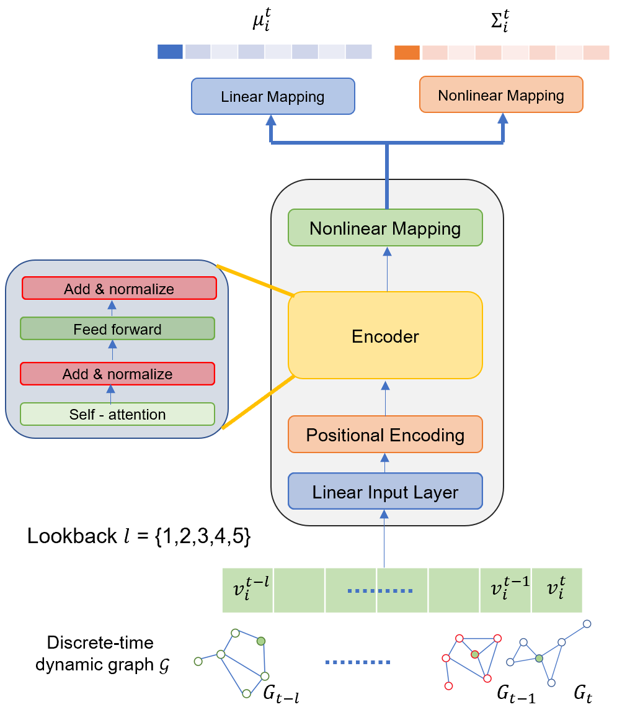

# TransformerG2G

### Introduction


This repository contains the code for our work: [TransformerG2G](https://arxiv.org/abs/2307.02588)


### Running the code
The datasets can be downloaded by running download_data.sh file.

Within the folder for each dataset there are four python files necessary for running experiments. For example, consider the Reality Mining dataset. There are four files: main.py, eval-reality-mining.py, model.py and utils.py. Running the main.py file trains the transformerG2G model, and predicts and saves the embeddings. The TransformerG2G model is implemented within the models.py file. The file named eval-reality-mining.py, trains the classifier to perform link prediction and compute the MAP and MRR values.

### Cite our work
If you found this work useful, please consider citing our papers
```
@article{varghese2024transformerg2g,
  title={TransformerG2G: Adaptive time-stepping for learning temporal graph embeddings using transformers},
  author={Varghese, Alan John and Bora, Aniruddha and Xu, Mengjia and Karniadakis, George Em},
  journal={Neural Networks},
  volume={172},
  pages={106086},
  year={2024},
  publisher={Elsevier}
}
```
